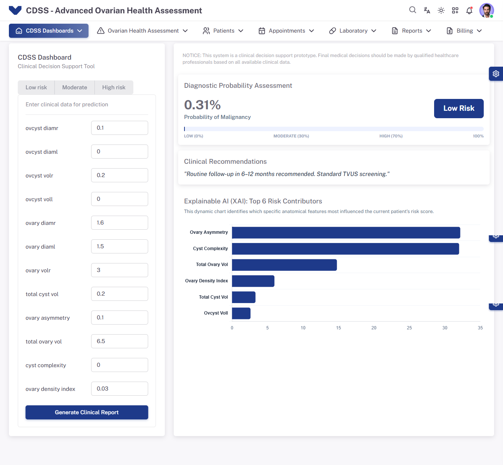
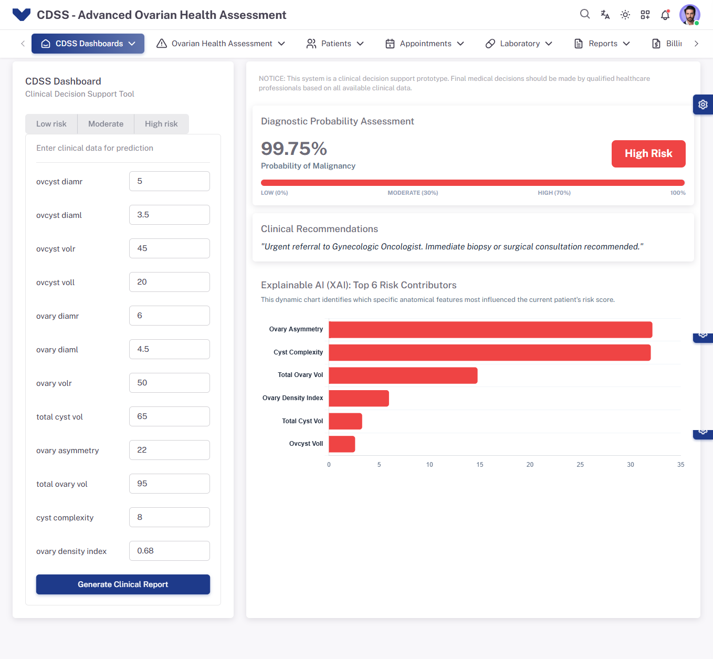
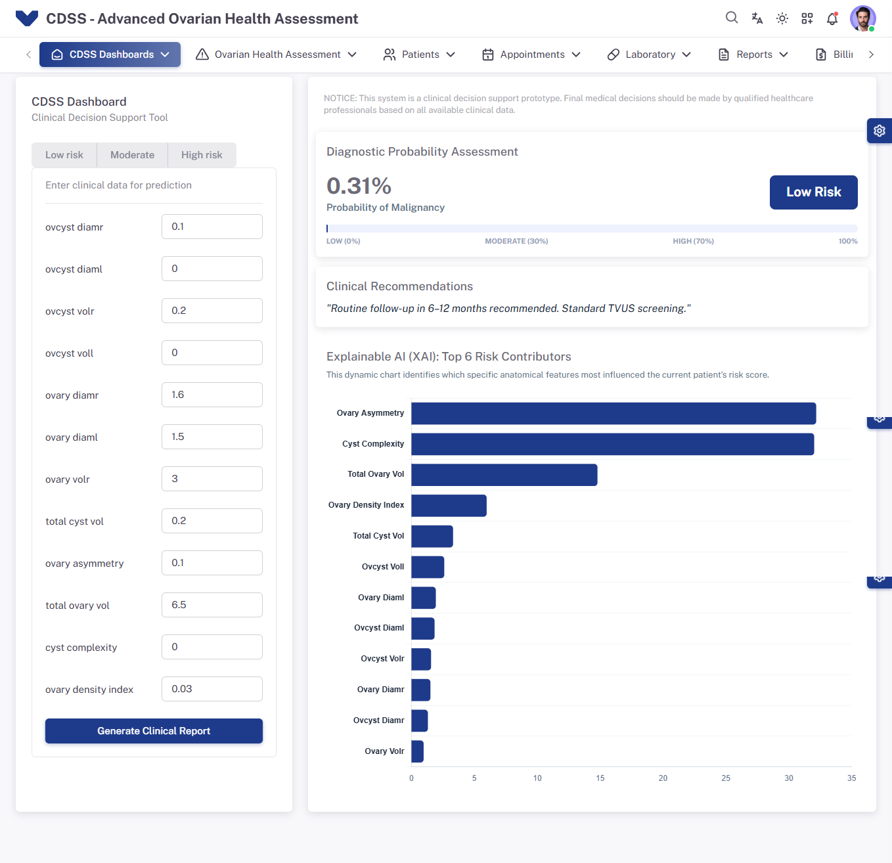
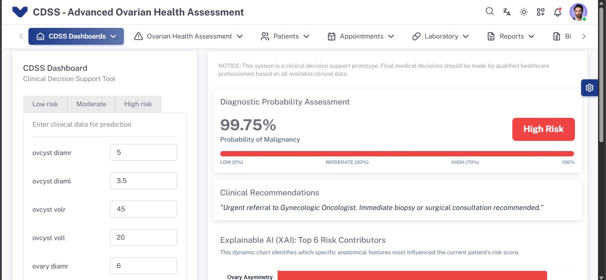

# CDSS - Advanced Ovarian Health Assessment

**Clinical Decision Support System (CDSS)** prototype for ovarian cancer screening built with Flask and a Vuexy-based frontend.

---

## Overview 🔬
This repository contains a demo CDSS web application that performs risk stratification for ovarian masses based on TVUS (transvaginal ultrasound) measurement inputs. It uses a Flask backend to serve a Jinja2-powered frontend and demonstrates model inference, explainability (feature impact), and clinical recommendation rendering.

## Features ✅
- Web form for inputting TVUS measurements
- Risk probability output and tiering (Low / Moderate / High)
- Explainable AI chart (top contributors)
- Clinical recommendations and risk visualization

## Requirements 🧰
- Python 3.10+
- (Optional) virtualenv / venv

## Setup & Run 🔧
1. Clone the repo:

   ```bash
   git clone <repo-url>
   cd <repo-folder>
   ```

2. Create and activate a virtual environment:

   ```bash
   python -m venv .venv
   .venv\Scripts\activate    # Windows PowerShell
   source .venv/bin/activate   # macOS / Linux
   ```

3. Install dependencies:

   ```bash
   pip install -r requirements.txt
   ```

4. Run the app:

   ```bash
   flask run --host=127.0.0.1 --port=5000
   ```

5. Open the app in your browser: http://127.0.0.1:5000

> Notes: If your Flask app uses a different entry point, start it accordingly (for example, `python app.py`).

---

## Screenshots 📸
Screenshots captured during local runs (embedded from repository root):

### Predict results — different cases








### App overview



> If screenshots do not display on GitHub (large images or spaces in filename), you can move them into a folder (e.g., `docs/screenshots/`) and update paths accordingly.

---

## Recommended next steps 💡
- Move screenshots into `docs/screenshots/` and add optimized/thumbnail versions to reduce repo size.
- Add route documentation and example cURL requests for the `/predict` endpoint.
- Add unit tests and automated checks.

---

## License
Add your license here (e.g., MIT). If you want, I can add a LICENSE file.

---

If you'd like changes to the README text, structure, or to include additional images, tell me which updates to make and I will apply them. 🚀